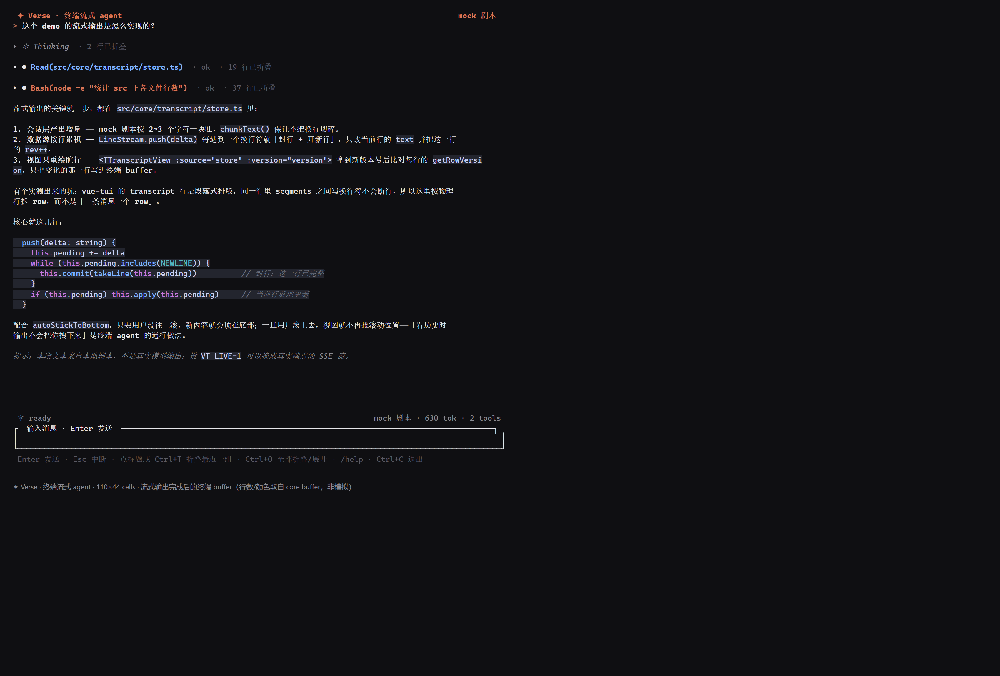
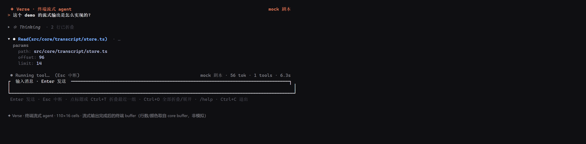
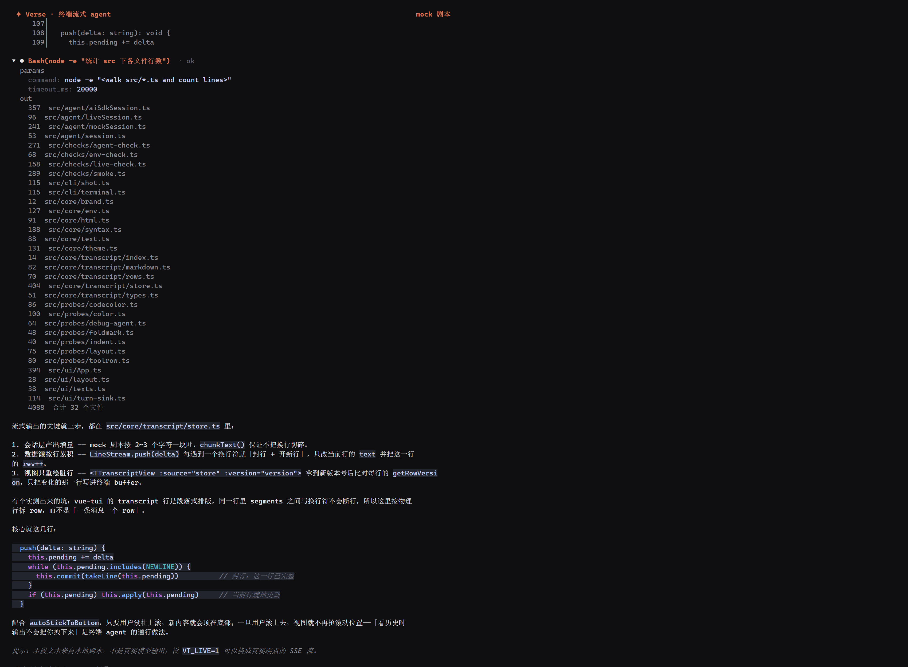

# Verse · 终端流式 agent

> 用 Vue 3 + [`@simon_he/vue-tui`](https://vue-tui.pages.dev/) 搭的终端 AI agent 界面：思考流、真实执行的工具调用、逐行增量渲染的 markdown，思考 / 工具块可折叠。
> A streaming terminal agent UI in Vue 3 — think / tool-call / answer panes with collapsible groups, provider config in `.env`, headless-verifiable.




## 它是什么

一个克隆下来就能跑的终端 agent demo，重点在**流式链路与界面工程**，不在模型能力：

- **流式**：增量按物理行累积，视图只重绘脏行（双版本号：行的 `rev` + 数据源的 `version`）。
- **折叠**：每个「思考」和每次「工具调用」都是一个可折叠组，头部常驻、内容随状态显隐（`Ctrl+T` 最后一个 / `Ctrl+O` 全部 / 点标题）。
- **工具**：AI SDK 工具循环（`read_file` / `write_file` / `edit_file` / `bash` / `ls`），`bash` 的 stdout **边跑边写进转写**。
- **三路会话**：离线 mock 剧本（默认，保证离线可演示）/ 裸 SSE 纯文本流 / AI SDK 工具 agent —— `/mock` `/live` `/ai` 随时切。
- **provider 配在 `.env`**：`.env` → `.env.local` 后者覆盖，命令行里已有的变量永不被文件覆盖。
- **无头可验证**：三套断言脚本（27 + 6 + 10 项），退出码即结论；关键结论用 `fs` 独立核对，不采信模型自述。

依赖极简：`node` 直接跑 TypeScript（类型剥离），**没有打包器、没有构建步骤**。

## 快速开始

```bash
pnpm install
cp .env.example .env    # 填 provider；不填也能跑（默认离线 mock 剧本）
pnpm dev                # 交互式
```

要求 **Node ≥ 22.18**（`node` 直接跑 `.ts`，靠内置类型剥离，不需要任何 flag；23.6+/24 同样可以）。

| 命令 | 说明 |
|---|---|
| `pnpm dev` | 交互式 TUI（需要真实 TTY；无 TTY 会直接提示去跑 `pnpm smoke`） |
| `pnpm smoke` | 无头：渲染 / 流式 / 折叠 / 颜色 20 项 + `.env` 加载行为 9 项（离线，不需要 key） |
| `pnpm live` | 无头：真实 SSE 端点的纯文本流 6 项 |
| `pnpm agent` | 无头：AI SDK 工具 agent 10 项（含用 `fs` 独立核对模型写下的文件） |
| `pnpm shot` | 把跑完的一轮渲染成带色 HTML，便于出图 |
| `pnpm typecheck` | `tsc -p tsconfig.json`（零报错） |

## 配置：`.env`

provider 配置放 `.env`（已被 `.gitignore` 忽略），每个入口文件开头统一 `loadDotEnv()` 一次，之后正常读 `process.env`：

```bash
cp .env.example .env
# .env
VT_AGENT=ai                        # mock（默认）| live | ai
VT_BASE_URL=https://<your-endpoint>/v1   # 任何 OpenAI 兼容端点
VT_MODEL=<model-id>
VT_API_KEY=<key>                   # 只留在本机文件里，不进命令行、不进仓库
VT_AGENT_ROOT=./.agent-sandbox      # 工具只能动这个目录
VT_SPEED=1                          # 流式速度倍率，调试用
```

加载规则（9 项断言守着，见 `pnpm smoke` 的第二段）：

| 规则 | 说明 |
|---|---|
| 顺序 | `.env` → `.env.local`，**后者覆盖前者** |
| 优先级 | **命令行 / 系统里已有的键永不被文件覆盖**（`VT_MODEL=... pnpm dev` 临时换模型很方便） |
| 坏行 | 只警告，不中断启动 |
| 缺文件 | 静默跳过，没有 `.env` 也能跑离线 mock |
| 密钥 | 只回报**键名**，值不进日志 / 终端 / 结果 |

进 TUI 后用 `/env` 随时看当前生效的配置（脱敏）：

```
provider  <host> · model <model-id> · key 已设置(不回显)
agent 工作区  <repo>/.agent-sandbox
.env  .env（带入 6 个键：VT_AGENT, VT_BASE_URL, VT_MODEL, VT_API_KEY, VT_AGENT_ROOT, VT_SPEED）
```

## 交互

| 操作 | 说明 |
|---|---|
| `Enter` | 发送当前输入 |
| `Esc` | 中断正在跑的这一轮（转写里写入「已中断」） |
| `Ctrl+End` | 视口跳回底部 |
| **`Ctrl+T`** | **折叠 / 展开最近一组**（思考或工具） |
| **`Ctrl+O`** | **折叠 / 展开全部分组** |
| **点标题** | 鼠标点分组标题也能折叠 / 展开（库画 ▸/▾ 并带命中区） |
| 滚轮 / `PgUp` | 翻历史；一旦你往上滚，新内容不再把你拽回底部 |
| 命令 | `/help` `/clear` `/long` `/mock` `/live` `/ai` `/env` `/fold` `/exit` |

`/long` 会吐一段长回答，专门用来看长内容下的增量重绘与滚动保持。

## 排版与折叠

终端排版的可读性基本来自「层级 + 留白」，这里把两件事定死：

| 层级 | 缩进 | 例 |
|---|---|---|
| 用户消息 / 正文 / 分组头部 | 0 | `> 问题` · `▾ ● Bash(...)  · ok` · `▸ ✻ Thinking  · 2 行已折叠` |
| 组内 section | 2 | `params` · `out` |
| section 的值行 | 4 | `command: dir /b` · `357  src/agent/aiSdkSession.ts` |

留白：每个块（用户消息 / 思考组 / 工具组 / 正文 / 提示）开始前插**一行空行**，由 `store.blank()` 统一处理 —— 它只在「上一行不是空行」时插入，所以不会出现连续空行。这一条是观感的关键。

噪音文案一律去掉：折叠行不重复「（点我展开）」（提示栏里说一次就够），无参数的调用不打「（无参数）」，状态用 `· ok` / `· err` 与标题分开。工具输出**按原样显示**，不为了对齐去改工具自己的格式。

**流式进行中**：只有正在写的那一块是展开的，前面的组自动收起（截图是跑到第二个工具时的状态，状态栏显示 `Running tool…`）：



**手动展开全部**（`Ctrl+O` 或点标题；工具带 `params` 块）：



```
▸ ✻ Thinking  · 2 行已折叠
▸ ● Read(src/core/transcript/store.ts)  · ok  · 19 行已折叠
▸ ● Bash(node -e "统计 src 下各文件行数")  · ok  · 34 行已折叠
```

三条实现事实都是实测出来的（探针留在 `src/probes/toolrow.ts` / `src/probes/foldmark.ts`）：

| 事实 | 做法 |
|---|---|
| 库的 `tool-call` row **能折叠**（自带 ▸/▾ 与点击命中区） | 头部行用 `kind: 'tool-call'`，`collapsed` 只用来驱动标记 |
| 但它的 `body` 是**段落式**：段内换行不断行，塞不下 params / 输出 | 内容行仍是独立 row，**显隐由数据源过滤**（`visibleEntries()` 按组过滤） |
| 折叠必须真的减少可见行 | `rowCount()` / `getRow()` 都走过滤后的行；`toggleGroup()` 里 `version++` 让视图重算 |

工具参数来自会话层的 `ToolStep.params`（AI SDK 那路直接透传工具的 `input` 对象）。展示前每值截断到 120 字符，长文本显示成 `content: (43 字符)` 而不是啰嗦全文：

```
● Bash(node -e "统计 src 下各文件行数")  · ok
  params
    command: node -e "<walk src/*.ts and count lines>"
    timeout_ms: 20000
  out
    96  src/agent/liveSession.ts
    ...
```

**折叠规则（手风琴）**：一轮进行中只有**正在写的那块**展开，它一出现前面的组就自动收起；正文开始流式输出时（此时没有「当前组」）全部收起；**一轮结束（含 Esc 中断）后全部收起**。想细看就点标题或 `Ctrl+T`（最近一组）/ `Ctrl+O`（全部折叠或展开）。

规则落在两处：`store.soloExpand(keepId?)`（只留一个展开，或全部收起）与 `src/ui/turn-sink.ts` 里的四处调用——新建思考组 / 新建工具组 / 正文开始 / 回合收尾。想改回「工具组保持展开」，把 `finish()` 里那行 `store.soloExpand()` 删掉即可。

轨迹可以用探针一眼看全：

```bash
node src/probes/foldrule.ts
#   thinking  展开: thinking(1行)
#   tool      展开: tool(4行)          ← 思考组收起，当前工具组展开
#   tool      展开: tool(13行)         ← 第二个工具出现，前一个收起
#   answering 展开: （无，全部收起）    ← 正文开始
#   idle      展开: （无，全部收起）    ← 回合结束
```

> `pnpm live` / `pnpm agent` 会真的打端点：背靠背连续跑会撞上游 RPM 限流（实测免费档 10 RPM），
> 报 `AI_APICallError: request limited RPM reached` 时等一分钟再单跑一次即可，不是代码问题。

### 颜色：真彩 / 256 / 16 / 8 四级

配色统一用 hex 写在 `src/core/theme.ts`，渲染器按终端能力自动降级。下面是同一份 palette 在四种色深下**真实写出的字节**（`src/probes/color.ts` 抓的 stdout 渲染器原始输出，不是照文档抄的）：

| 模式 | 前景转义形式 | accent `#d97757` 实际写成 |
| --- | --- | --- |
| `truecolor` | `ESC[38;2;R;G;Bm` | `38;2;217;119;87` |
| `ansi256` | `ESC[38;5;Nm` | `38;5;173` |
| `ansi16` | `ESC[3xm` / `ESC[9xm` | `91m` |
| `ansi8` | `ESC[3xm` | `31m` |

粗体 / 斜体 / 反显（`ESC[1m` `ESC[3m` `ESC[7m`）在四种模式下都照常输出。

自动探测的顺序：`COLORTERM` 含 `truecolor`/`24bit` → `TERM_PROGRAM` 是 VS Code / WezTerm / Alacritty / Ghostty / Kitty / iTerm / Windows Terminal / Tabby / Hyper / Rio / Contour → Windows 下的 `WT_SESSION` 一类变量 → 回落看 `TERM` 里的 `256color` / `color` / `dumb`。输出不是 TTY 时直接按真彩走。可用 `VUE_TUI_COLOR_MODE=truecolor|ansi256|ansi16|ansi8` 强制指定（旧名 `DIMCODE_COLOR_MODE`）。

```bash
VUE_TUI_COLOR_MODE=ansi16 node src/probes/color.ts   # 按转义形式分类计数
```

> 缺口：库**不认 `NO_COLOR`**（43 个 dist 文件里一次都没出现），也没有单色档——`parseColorMode` 只认上面四个值。要彻底去色只能在终端侧做。

### 彩色输出：哪些地方真的有颜色

四级降级只是底色，具体配色分五类，全部集中在 `src/core/theme.ts`：

| 位置 | 上色方式 |
| --- | --- |
| **代码块** | 按围栏语言做语法高亮：关键字 / 字符串 / 数字 / 函数名 / 类型 / 注释 各一色。实现在 `src/core/syntax.ts`（约 200 行，关键字表驱动，**不引 shiki / highlight.js**——那些库产出 HTML 或主题 JSON，几百 KB 起步还得再映射回 ANSI） |
| **工具组头部** | 按工具类型上色：`read*` 蓝 · `write*` 绿 · `edit*` 琥珀 · `bash` 橙 · `ls` 青 · `grep` 品红。名字做前缀归一化，mock 剧本的 `Read(...)` 与 AI SDK 的 `read_file` 都认 |
| **工具参数** | `key:` 暗灰 + 值亮色分两段，扫参数时不用逐字读 |
| **分组头部** | 思考组暗色斜体，工具组按类型（见上），折叠后追加的「N 行已折叠」统一淡灰 |
| **其它** | 用户消息 `>` 前缀用 accent 色、状态栏按状态绿/红、markdown 行内 `code` 带底色、正文里的 `**粗体**`/`*斜体*`/链接各有样式 |

支持高亮的围栏语言：`ts` / `js` / `json` / `bash` / `yaml` / `diff`（` ```diff ` 的 `+` / `-` / `@@` 行红绿分明）；其它围栏回落成单色代码块——**认不出语言只损失颜色，不影响可读性**。

```bash
node src/probes/codecolor.ts    # 把「整行都是代码底色」的 row 连 style 一起打出来，看每段是什么颜色
```

写这段时被自己的断言抓出两个 bug（见「踩过的坑」最后两条）：围栏状态被流式增量翻转奇偶次、以及三个引用了但从未定义的样式 token 让整行静默不上色。

## 架构

```
src/
  cli/                   可执行入口
    terminal.ts            交互式 TUI：createTerminalApp + stdout 渲染器 + stdin driver + 退出清理
    shot.ts                出图：把跑完的 buffer 转成带色 HTML（多轮用 ;; 分隔）
  checks/                断言脚本：退出码即结果
    smoke.ts               渲染 / 流式 / 折叠 / 颜色 20 项（离线 mock）
    live-check.ts          真实 SSE 端点 6 项
    agent-check.ts         AI SDK 工具 agent 10 项（含 fs 独立核对）
    env-check.ts           .env 加载行为 9 项（优先级 / 覆盖 / 坏行 / 不外泄）
  probes/                一次性探针：摸清库行为 + 排版回归
    toolrow.ts / foldmark.ts / indent.ts / layout.ts / debug-agent.ts
  ui/                    界面层
    App.ts                 组件装配：版面、命令、键盘、对外 AppApi
    layout.ts              版面坐标（layoutOf）
    texts.ts               命令帮助、提示栏、状态行对齐、输入清洗
    turn-sink.ts           一轮对话的事件映射（思考 / 工具 / 正文 → 分组）
  core/                  底座（与界面、会话无关）
    transcript/
      types.ts               行 / 分组的类型（叶子模块，无依赖）
      markdown.ts            行级 markdown 与参数格式化（纯函数）
      rows.ts                entry → TTranscriptRow（缩进、折叠标记）
      store.ts               LineStream + TranscriptStore（分组、可见行过滤、版本号）
      index.ts               对外桶文件
    env.ts / text.ts / theme.ts / html.ts
  agent/                 会话层（同一接缝的多个实现）
    session.ts             接缝类型（AgentSession / StreamStep / ToolStep / TurnSink）
    mockSession.ts         本地剧本（工具步骤真的起子进程）
    liveSession.ts         裸 SSE 纯文本流
    aiSdkSession.ts        AI SDK 工具 agent（read / write / edit / bash / ls）
```

导入方向是单向的：`cli/checks/probes → ui/agent → core`，core 内部 `store → rows → markdown → types`，无反向依赖、无循环。`checks/*` 与 `probes/*` 只通过 `ui/App.ts` 暴露的 `AppApi` 触碰界面，不 import 组件内部。

数据流：

```
会话层(剧本 / SSE / AI SDK)  ──delta──▶  TranscriptStore  ──version──▶  TTranscriptView  ──只重绘脏行──▶  终端 buffer
```

版面按 plane 分区（库的 `TRenderPlane`）：transcript（每 10~20ms 一次）、chrome 状态栏（每 100ms 一次）、输入框（只在按键时）互不干扰 —— 正文刷 30 行也不会让输入框光标闪一下。

## AI SDK 工具 agent

`src/agent/aiSdkSession.ts`：用 Vercel AI SDK（`ai@7` + `@ai-sdk/openai-compatible` + `zod`）写的极简编码 agent，工具集形状参照 [pi](https://github.com/badlogic/pi-mono)。

```bash
# 交互式：模型自己决定读哪个文件、跑什么命令
VT_AGENT=ai pnpm dev

# 无头端到端：10 项断言，含「用 fs 独立核对模型说写下的文件」
pnpm agent
```

```
streamText({ model, system, messages, tools, stopWhen: stepCountIs(8) })
  fullStream ─┬─ reasoning-delta ──▶ 思考行
              ├─ tool-call        ──▶ 新建工具行（按 toolCallId 建键，并发不串行）
              ├─ tool-result      ──▶ 工具行标 ok / err
              └─ text-delta       ──▶ 正文行（逐行 markdown）
```

几个刻意的点：

- **工具在 `respond()` 内部创建**，闭包直接拿到 sink —— `bash` 的 stdout 因此是边跑边写进转写的。
- **工具行按 `toolCallId` 建键**：一个 step 里并发多个调用不会错位。
- **文件工具限制在 `VT_AGENT_ROOT` 内**，越界路径直接拒绝；`edit_file` 要求唯一匹配，不唯一就报错。
- **历史用 `result.responseMessages` 累积**（含 tool 消息），多轮能接着聊。
- **这不是沙箱**：`bash` 跑的是真实命令，只是把 cwd 固定在 `.agent-sandbox`。别拿它跑不可信输入。

## 验证（实测）

三个无头套件，退出码即结论；命令行不需要带任何 `VT_*` 变量（配置全从 `.env` 来）：

| 命令 | 覆盖 | 断言数 |
|---|---|---|
| `pnpm smoke` | mock 剧本的渲染链路 + `.env` 加载行为 | 20 + 9 = 29 |
| `pnpm live` | 真实 SSE 端点的纯文本流 | 6 |
| `pnpm agent` | 真实 API + 真实工具循环（含 `fs` 独立核对） | 10 |

断言的是**事实**而不是「函数被调用过」。真实输出：

```
# pnpm smoke（离线）
✔ 流式是增量的 — 采样 224 次，version 跨度 499
✔ 产生了多帧提交 — commit 次数 521
✔ 思考与每次工具调用各自成组 — 3 个分组（1 个 thinking + 2 个 tool）
✔ 流式中只展开当前组（手风琴） — 采样 224 次，展开组数最大值 1（期望 ≤ 1）
✔ 回合结束后分组全部收起 — 3 个分组，收起 3 个
✔ 工具调用显示了参数 — 展开态工具组含 params 块：path: src/core/transcript/store.ts
✔ 折叠真的隐藏了内容行 — 可见行 88 → 29；折叠后仍能读到「合计」= false
✔ 展开真的恢复内容行 — 可见行 29 → 88（展开基线经显式展开取得，往返无损）
✔ 代码块按语言上色 — 5 行代码，合计 5 种前景色：#c9d1f2 #7fb3ff #c678dd #56b6c2 #6f7480
✔ 分组头部按类型上色 — 头部出现 4 种颜色：#8b8b93 #5a5a63 #7fb3ff #d97757

# pnpm live（真实端点，约 1875 tok 的一轮）
✔ 端点真的在流式返回 — 采样 562 次，version 跨度 1478
✔ 模型文本进入了转写 — 21 行正文，约 1875 tok
✔ markdown 被解析成结构化行 — 行样式集合：code/plain/bullet
✔ 耗时合理 — 整轮 19.6s

# pnpm agent（真实 API + 真实工具）
✔ 模型写下的文件在磁盘上真的存在且内容正确 — 磁盘上 3 行，第 2 行含关键句
✔ bash 的真实输出进了转写 — 工具输出 31 行；含 demo.txt = true
✔ 流式是增量的 — 采样 372 次，version 跨度 237
✔ 折叠真的收起内容（可见行下降 + ▸ 标记） — 可见行 88 → 40
✔ 再展开恢复（▾ 且行数变多） — 可见行 40 → 205
```

两条断言纪律值得单独说：

- **折叠状态断言读的是行数据，不是屏幕像素**。屏幕受视口滚动影响，会变成 flaky 测试；`getRow()` 拿到的「喂给视图的东西」才是确定的。渲染是否真的落到终端上，另有从库的真实 buffer 读回屏幕文本的断言（`screenText()`）守着，两者分开。
- **模型自述「我写好了」不算数**：`pnpm agent` 用 `fs` 独立把那个文件读回来核对（存在 + 行数 + 关键句），而不是相信转写里的文字。

产物落在 `.artifacts/`：`smoke-screen.txt`、`smoke-report.json`、`agent-report.json`、`live-report.json`。

## 踩过的坑

**库行为（`@simon_he/vue-tui` 1.1.9，全部实测）**

- **transcript 行是「段落式」的**：同一行里 segments 之间写换行符**不会**断行，所以这里按物理行拆 row，而不是「一条消息一个 row」。一开始按消息拆行时整段 markdown 挤成一坨。
- **`TInputBox` 的 `placeholder` 没接线**：types 里有、1.1.9 的实现里没渲染，所以输入提示放进了框线标题。
- **`TInputBox` 提交后不会自己清空**：把 `modelValue` 置空不生效（组件内部持有文本，也没 expose `clear()`），做法是提交后自增 `key` 强制重建输入框。这个坑是往 PTY 里连发两次 `/env` 才暴露的 —— 第二次提交的文本实际是 `/env/env`，掉进了「未知命令」分支。顺带加了控制字符清洗和 `VT_DEBUG_INPUT=1`（把**原始提交文本按 JSON** 记进 `.artifacts/input-debug.log`）。
- **Node 的类型剥离模式不支持构造函数参数属性**（`constructor(private x: T)` → `ERR_UNSUPPORTED_TYPESCRIPT_SYNTAX`）。

**自己写的工具也得防**

- **`bash` 必须设输出上限，否则会堵死事件循环**：模型跑 `dir /b *.txt | find /c /v ""` 时，`find` 命中的是 git-bash 里的 MSYS 版本，变成全盘遍历、吐出几万行；每行都写进响应式 store 触发一次调度 → **事件循环被饿死，连 `setInterval` 心跳都停了**。现在的做法是：最多显示 200 行 / 64KB，超限杀进程树，并把 `%SystemRoot%\System32` 提到 PATH 最前面（让 Windows 的 `find.exe` 赢过 MSYS 的）。
- **Windows 上只等 `'close'` 事件不够**：孙子进程（`dir | find`）不退出时 `kill()` 杀不掉管道，工具会永远 pending。改成 `taskkill /T /F` 杀进程树 + `'exit'` 兜底 + 硬超时。
- **出图时 Chrome 的 `--screenshot=` 用相对路径会静默不写文件**（退出码 0，磁盘上还是旧图）：给绝对路径，并确认文件的修改时间变了再拿去用。

**自己写的数据源也会错得很隐蔽**

- **带副作用的状态判定不能放在「每次增量都会调」的函数里**：原先「遇到 ``` 就翻转 `inFence`」写在 `classOf()` 里，而 `classOf()` 对**未完成的行每个流式增量都会调一次**、封行时又调一次 → 同一个 ```` ```ts ```` 被翻转奇偶次，围栏状态时对时错（表现是代码块有时单色、有时压根没被当成代码）。现在围栏只在 `commit()`（封行，每行一次）里翻转，`classOf()` 是纯函数。
- **`styles` / `syntax` 别标成 `Record<string, Style>`**：那样 `styles.thinkingHeader` 这类拼错的键 tsc 查不出来，运行时拿到 `undefined` → 那一行**静默不上色**（终端不会报错）。本仓库曾有 3 个这样的引用（`thinkingHeader` / `userPrompt` / `dim`，其中 `dim` 影响所有工具输出行），改成强类型 const 后 tsc 立刻全部报出来。

## 已知边界

- mock 剧本会在正文末尾明说「本段文本来自本地剧本，不是真实模型输出」—— 演示不假装真模型。
- **live 模式只做纯文本流，不解析 tool-call**；要真实模型调工具请用 `/ai`（AI SDK 那路）。
- 思考 / 工具的分组状态**不进会话历史**：重启后新会话是全新状态。
- 表格（`| a | b |`）不做特殊渲染，按原文输出。
- 折叠只影响**显示**：内容行仍在内存里（`visibleEntries()` 过滤），展开是瞬时且不重跑任何东西。
- 长回答的虚拟化依赖 `TTranscriptView` 内部实现，本项目未测帧率上限。
- 换行由库负责，**续行没有悬挂缩进**：折行后从第 0 列开始。要做悬挂缩进得按视口宽度预折行，而宽度随 resize 变，收益不抵复杂度。
- 工具输出按原样显示，所以工具自身的对齐（例如 `wc -l` 式数字右对齐）会保留。
- 每次 `pnpm live` / `pnpm agent` 都会真的请求端点：注意上游的 RPM 配额。

## 许可

MIT
